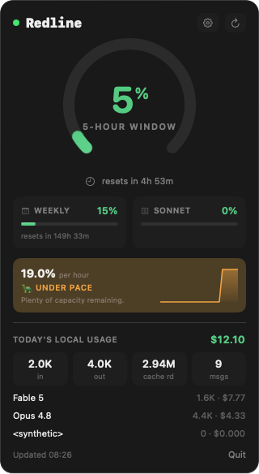
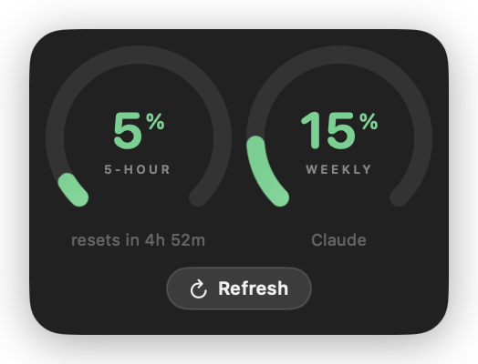

# Redline

A native macOS menu-bar app that tracks your **Claude Code** and **OpenAI Codex** usage quotas in real time — so you never get surprised by a 5-hour or weekly limit mid-session.

Everything runs **locally**. Your credentials never leave your machine — the app talks only to Anthropic's own API using your existing Claude Code login, and reads local transcripts on disk.

<p align="center">
  
  &nbsp;&nbsp;
  
</p>

## Features

- **Live limits** — 5-hour, weekly, and per-model (Opus/Sonnet) windows with reset timers.
- **Burn rate + projection** — "12%/h · full in 2h 40m", with a sparkline of the 5-hour trend and a 🐢/🐇/✅ pace verdict.
- **Today's local cost** — parses your Claude Code transcripts and prices tokens per model.
- **Codex** — 5-hour and weekly limits read from `~/.codex/sessions`.
- **Real desktop widget** (WidgetKit) — add "Redline" from the system widget gallery; Small (5-hour) and Medium (5-hour + weekly), with a built-in Refresh button.
- **Optional floating panel** — an always-on-top gauge pinned over your screen (off by default; toggle in settings).
- **Smart alerts** — a notification before you cross a configurable threshold.
- Liquid-Glass UI, color-coded menu-bar gauge, launch-at-login.

## Install

1. Download `Redline.dmg` from the [latest release](https://github.com/sergey-lee/redline/releases).
2. Open it and drag **Redline** to **Applications**.
3. Launch it. On first run macOS asks permission to read the Claude Code keychain item — choose **Always Allow**. It also asks once to allow notifications.

To add the desktop widget: right-click the desktop → **Edit Widgets** (or Notification Center → Edit Widgets) → find **Redline** → drag Small or Medium.

The released DMG is signed with a Developer ID and notarized by Apple, so it opens with a normal double-click.

## How it works

| Data | Source |
|------|--------|
| Claude subscription limits | `GET https://api.anthropic.com/api/oauth/usage` with your Claude Code OAuth token |
| Auth / token | Read from the macOS login keychain item `Claude Code-credentials`; auto-refreshed (rotating refresh token written back so Claude Code stays signed in) |
| Claude cost/history | Local `~/.claude/projects/**/*.jsonl` transcripts |
| Codex limits | Local `~/.codex/sessions/**/*.jsonl` (`rate_limits.used_percent`) |
| App → widget | A usage snapshot shared via the `group.net.alienminds.redline` App Group |

## Disclaimers

- **Undocumented API.** The Claude usage endpoint and OAuth client id are not officially documented — they're what the Claude Code CLI itself uses. They may change or break at any time.
- **Your credentials stay local.** The app reads your Claude Code login from the keychain to call Anthropic's API as you. It sends nothing anywhere else. Read the code — the only keychain access is in [`KeychainService.swift`](Sources/Redline/KeychainService.swift) and [`TokenManager.swift`](Sources/Redline/TokenManager.swift).
- **Cost figures are estimates** from a built-in price table; your real Max/Pro bill is a flat subscription.
- Codex limits require the Codex CLI to have written `rate_limits` to its session log — run it at least once.

## Build from source

Requires macOS 14+, Xcode 26+, and [XcodeGen](https://github.com/yonaskolb/XcodeGen) (`brew install xcodegen`).

```bash
xcodegen generate                                    # generate Redline.xcodeproj from project.yml
xcodebuild -scheme Redline -configuration Release \
  -allowProvisioningUpdates build                    # build app + widget
```

The project is generated from [`project.yml`](project.yml); the `.xcodeproj`, generated Info.plists, and entitlements are not committed.

### Cutting a release (maintainers)

```bash
# one-time: store notary credentials
xcrun notarytool store-credentials redline-notary \
  --apple-id "you@example.com" --team-id 4GZ4AH8Z6M --password "app-specific-password"

./release.sh            # archive → Developer-ID export → DMG → notarize → staple
```

Upload the resulting `dist/Redline.dmg` to GitHub Releases.

## Support

If Redline saves you from a mid-session rate limit, you can [buy me a coffee ☕](https://github.com/sponsors/sergey-lee).

## License

[MIT](LICENSE) © 2026 Sergey Li
